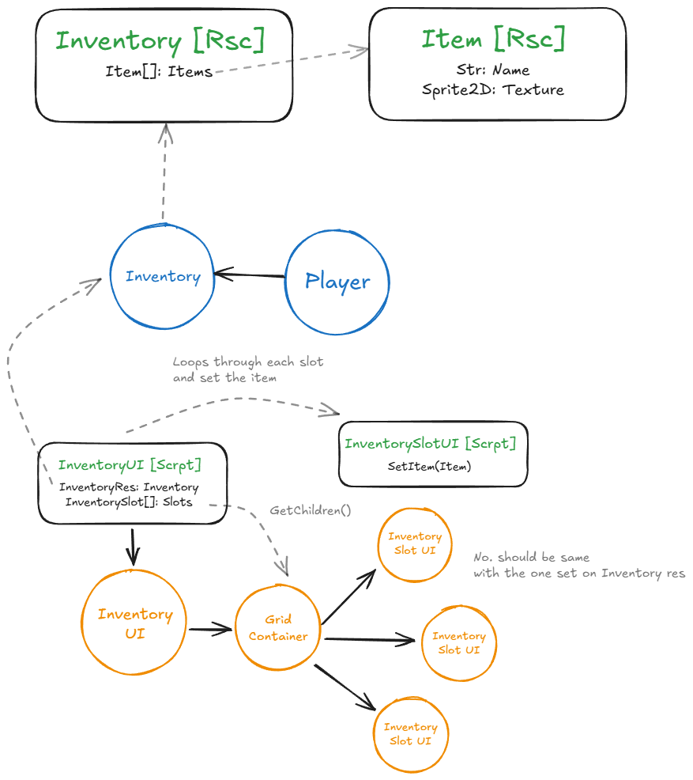

# Godot Basic Inventory System

## Overview

This project is a prototype for a basic inventory system in Godot 4 using C#. It demonstrates how to define items and inventories as resources, and how to display the player's inventory in a UI grid.

---

## High-Level Architecture

The following diagram illustrates the main components and their relationships:

- **Inventory [Rsc]:** Resource holding an array of items.
- **Item [Rsc]:** Resource representing an item (name, icon, etc).
- **Player:** Node with a reference to the player's inventory.
- **InventoryUI [Script]:** Script that loads the inventory resource and populates the UI slots.
- **InventorySlotUI [Script]:** Script for each slot, displaying the item icon.
- **GridContainer:** Holds the inventory slot UI elements.

---

## Key Components

### 1. Item Resource

- **File:** `scripts/resources/Item.cs`
- **Description:** Defines an inventory item as a Godot Resource with exportable properties for the item name, icon, and max stack size.

### 2. Inventory Resource

- **File:** `scripts/resources/ItemInventory.cs`
- **Description:** Represents a collection of items as a Godot Resource. The `items` array holds references to `Item` resources.

### 3. Player Inventory Node

- **File:** `scripts/actors/player/PlayerInventory.cs`
- **Description:** Node attached to the player that holds a reference to the player's inventory resource.

### 4. Inventory UI

- **Files:**
  - UI Scene: `scenes/ui/ui_inventory.tscn`
  - UI Script: `scripts/ui/InventoryUI.cs`
- **Description:**
  - The inventory UI is a `Control` node with a grid of inventory slots.
  - On ready, it loads the player's inventory resource and populates the slots with item icons.
  - The UI can be toggled with the `ui_toggle_inventory` input action.

### 5. Inventory Slot UI

- **Files:**
  - Slot Scene: `scenes/ui/ui_inventory_slot.tscn`
  - Slot Script: `scripts/ui/InventorySlot.cs`
- **Description:**
  - Each slot is a `Panel` node with a background and an item icon.
  - The slot script exposes a `SetItem(Item item)` method to update the icon.

---

## Current Features

- **Item and Inventory Resources:** Items and inventories are defined as Godot resources for easy editing and serialization.
- **Inventory UI:** The player's inventory is displayed as a grid of slots, each showing the item's icon if present.
- **UI Toggle:** The inventory UI can be shown/hidden using the `ui_toggle_inventory` input action.

---

## To Implement:

- [ ] Implement inventory management logic (add/remove items, stacking, etc.)
- [ ] Add item interaction (drag/drop, use, etc.)

---

## Credits

- **Tiny RPG Character Asset Pack**  
  [https://zerie.itch.io/tiny-rpg-character-asset-pack](https://zerie.itch.io/tiny-rpg-character-asset-pack)
- **User Interface Essential**  
  [https://crusenho.itch.io/complete-ui-essential-pack](https://crusenho.itch.io/complete-ui-essential-pack)
